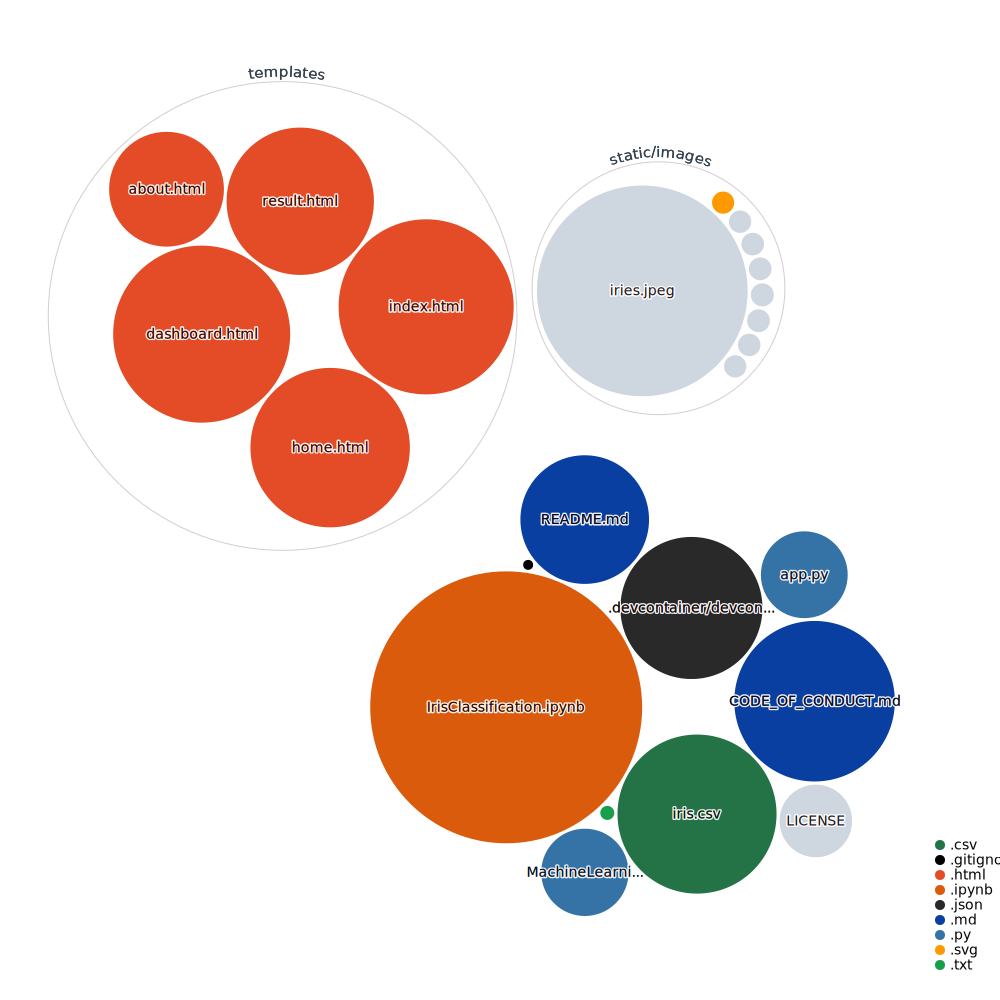
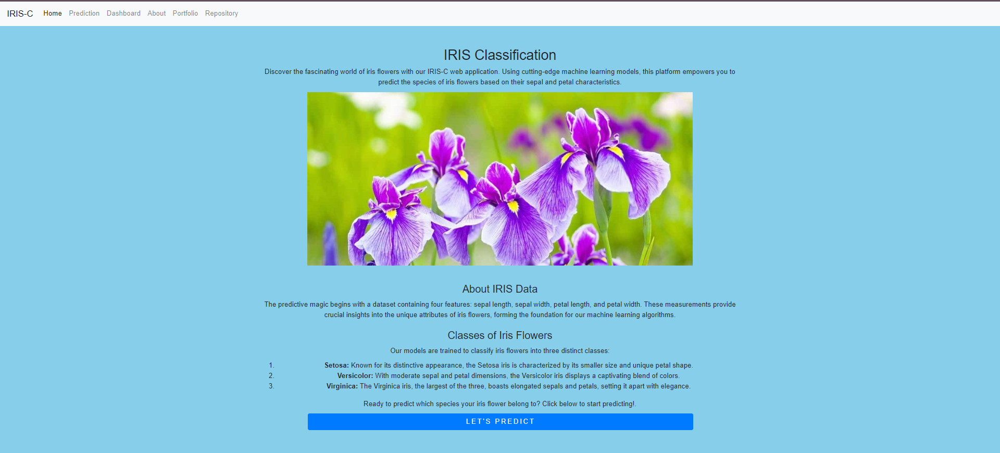
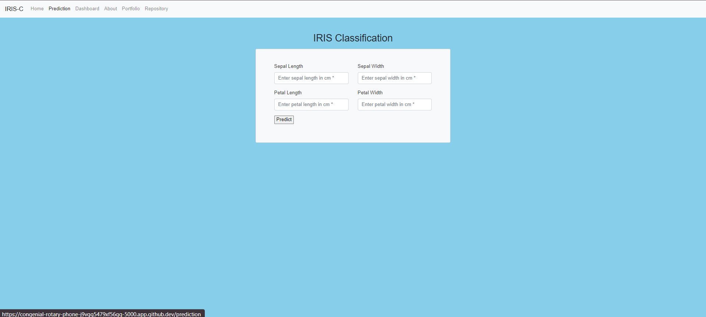
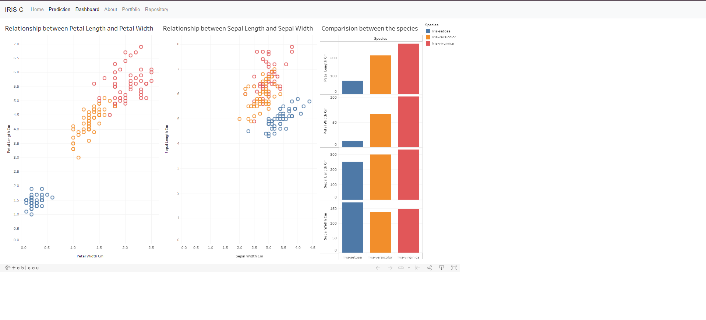
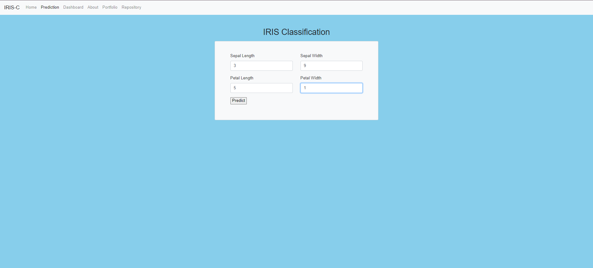
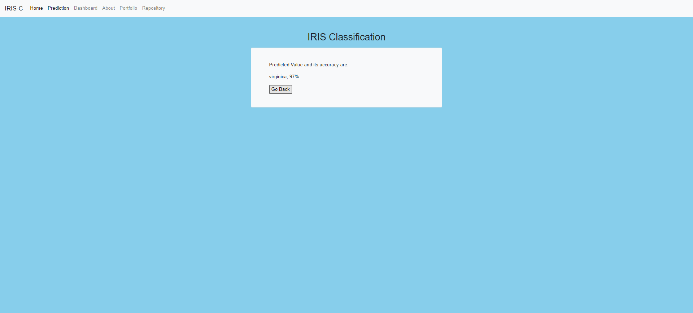
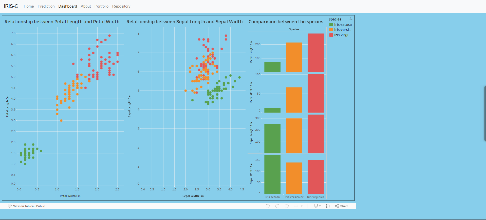

This repository contains a README file sample for Daytona Samples and the MIT License.

It can be used as a template to create sample repositories that can be added into [Daytona](https://github.com/daytonaio/daytona).

Once you finish your sample and it gets merged, you can open a PR in the Daytona repo and submit the sample into the [index file](https://github.com/daytonaio/daytona/blob/main/hack/samples/index.json).

# Machine Learning Model Deployment

Hello everyone, this is a machine learning model deployment project where we have presented the Iris classification model in an elegant basic minimal ui using flask web framework and deployed it in Azure cloud using Azure app service. 
    We initially made the notebook file, with model code and some data preperations (preprocessing). Then we have took some chunks of code and put the necessary in web project. Then we have deployed it into Azure app service. 
    We initially made this project as a requirement for an internship at Indian Servers. We are now making it open to contribution. 
    
    
### Authors :
    
    Tejaswi Talluru - Machine Learning Model in jupyter notebook.
    Krishna Priyatham Potluri - Flask Web Project and Azure Deployment.  (Myself)
    
### Contributors :

    Busam Divya Prakash - Updated UI and added data visualization using tableau.
    Rishabh Chauhan - Changed home page and shifted previous home page to prediction page.
   
   ____________________________________________________

## 🚀 Getting Started  

### Open Using Daytona  

1. **Install Daytona**: Follow the [Daytona installation guide](https://www.daytona.io/docs/installation/installation/).  
2. **Create the Workspace**  

       daytona create https://github.com/kittupriyatham/Quira-Daytona-023

3. launch the flask server using command:

        flask run
 
4. if above command does not work to initiate app, use the following one:

        python app.py

## Repo Visualization

## Screenshots of deployed project
### V1

### V2

### V3

### V4

Changed background colour of dashboard to match other pages.

Note: Dashboard pages are zoomed out to 75%

## Steps to Deploy in Azure App Service

### Using static deployment

To be updated soon...

### Using Dynamic and CI/CD deployment

To be updated soon...
